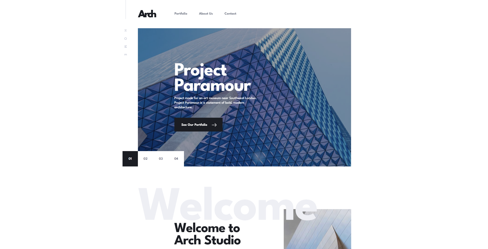

# Frontend Mentor - Arch Studio Multi-page Website



A modern, fully responsive multi-page website for an architecture studio built with React and advanced animations.

## 🌐 Live Demo & Links

- **Live Site**: [https://arch-studio-7zn5.onrender.com/](https://arch-studio-7zn5.onrender.com/)
- **Frontend Mentor Challenge**: [Arch Studio Multi-page Website](https://www.frontendmentor.io/challenges/arch-studio-multipage-website-wNIbOFYR6)
- **Repository**: [GitHub Repository](https://github.com/yourusername/arch-studio)

## 📋 Table of Contents

- [Overview](#overview)
- [Features](#features)
- [Built With](#built-with)
- [Getting Started](#getting-started)
- [Project Structure](#project-structure)
- [Key Components](#key-components)
- [What I Learned](#what-i-learned)
- [Continued Development](#continued-development)
- [Author](#author)

## 🎯 Overview

### The Challenge

This project is a solution to the Arch Studio multi-page website challenge from Frontend Mentor. The challenge required building a fully responsive 4-page architecture studio website with modern interactions and animations.

Users can:

- ✅ View the optimal layout for each page depending on their device's screen size
- ✅ See smooth hover states and animations for all interactive elements throughout the site
- ✅ Navigate between Home, About, Portfolio, and Contact pages with smooth transitions
- ✅ Experience interactive carousel on the homepage with project showcases
- ✅ View an interactive map with real locations on the Contact page
- ✅ Submit the contact form with proper validation:
  - Required field validation for Name, Email, and Message
  - Real-time error messaging

## ✨ Features

- **Fully Responsive Design** - Mobile-first approach ensuring perfect display on all devices
- **Smooth Page Transitions** - Custom page transition animations using GSAP
- **Interactive Carousel** - Featured projects showcase with smooth navigation
- **Interactive Map** - Real locations displayed using React Leaflet
- **Modern Animations** - Micro-interactions and scroll animations throughout

## 🛠 Built With

### Core Technologies

- **[React 19.1.0](https://reactjs.org/)** - Modern React with latest features
- **[Vite 7.0.4](https://vitejs.dev/)** - Fast build tool and dev server
- **[React Router DOM 7.7.1](https://reactrouter.com/)** - Client-side routing

### Styling & Animation

- **[SCSS Modules](https://sass-lang.org/)** - Modular styling with Sass preprocessing
- **[GSAP 3.13.0](https://greensock.com/gsap/)** - Professional-grade animations
- **CSS Flexbox** - Modern layout techniques
- **CSS Custom Properties** - Dynamic theming capabilities

### Interactive Features

- **[React Leaflet 5.0.0](https://react-leaflet.js.org/)** - Interactive maps

### Development Tools

- **[ESLint](https://eslint.org/)** - Code linting and formatting
- **[Vite Plugin SVGR](https://github.com/pd4d10/vite-plugin-svgr)** - SVG component generation

## 🚀 Getting Started

### Prerequisites

- Node.js (version 16 or higher)
- npm or yarn package manager

### Installation

1. **Clone the repository**

   ```bash
   git clone https://github.com/yourusername/arch-studio.git
   cd arch-studio
   ```

2. **Install dependencies**

   ```bash
   npm install
   # or
   yarn install
   ```

3. **Start the development server**

   ```bash
   npm run dev
   # or
   yarn dev
   ```

4. **Open your browser**

   Navigate to `http://localhost:5173`

### Build for Production

```bash
npm run build
# or
yarn build
```

The build artifacts will be stored in the `dist/` directory.

## 📁 Project Structure

```
src/
├── components/          # Reusable UI components
│   ├── Carousel/       # Homepage project carousel
│   ├── ContactDetails/ # Contact information display
│   ├── ContactForm/    # Contact form with validation
│   ├── Footer/         # Site footer
│   ├── Header/         # Navigation header
│   ├── Map/           # Interactive Leaflet map
│   ├── PageHero/      # Page header component
│   ├── ProjectsGrid/  # Portfolio grid layout
│   └── ...
├── pages/              # Page components
│   ├── HomePage.jsx
│   ├── AboutPage.jsx
│   ├── PortfolioPage.jsx
│   └── ContactPage.jsx
├── hooks/              # Custom React hooks
│   └── useSimplePageTransition.js
├── data/               # Static data and content
│   └── projects.js
├── assets/             # Images, icons, and media
└── styles/             # Global styles and design system
    └── _design-system.scss
```

## 🧩 Key Components

### Interactive Carousel

- **Auto-playing slideshow** with manual navigation
- **Smooth transitions** powered by GSAP
- **Touch/swipe support** for mobile devices
- **Responsive image handling** for all screen sizes


### Interactive Map Integration

- **Real locations** displayed using OpenStreetMap
- **Custom markers** for office locations
- **Responsive map sizing** across devices
- **Smooth zoom and pan** interactions

## 💡 What I Learned

### Advanced GSAP Animations

Working with GSAP taught me how to create professional-grade animations:

- **Timeline control** for complex animation sequences
- **ScrollTrigger integration** for scroll-based animations
- **Performance optimization** with will-change and transform properties

### React Performance Optimization

- **Lazy loading** of images and components
- **useMemo and useCallback** for expensive computations
- **Code splitting** with React.lazy for better initial load times

### Responsive Design Best Practices

- **Mobile-first CSS** approach
- **Fluid typography** using clamp() functions
- **Container queries** for component-based responsive design


## 🎨 Design System

The project follows a consistent design system with:

- **Typography scale** using the League Spartan font family
- **Color palette** with CSS custom properties
- **Spacing system** based on 8px grid
- **Component variants** for consistent UI patterns
- **Accessibility standards** WCAG 2.1 AA compliant

## 📱 Responsive Breakpoints

- **Mobile**: 375px and up
- **Tablet**: 768px and up
- **Desktop**: 1110px and up
- **Large Desktop**: 1440px and up

## 🙏 Acknowledgments

- **Frontend Mentor** for providing this excellent challenge
- **GSAP Community** for animation inspiration and techniques
- **React Community** for best practices and patterns
- **Open Source Contributors** of all the libraries used

---

**Built with ❤️ by KMA**

_This project demonstrates modern web development practices and is perfect for portfolios showcasing React, SCSS, and animation skills._
